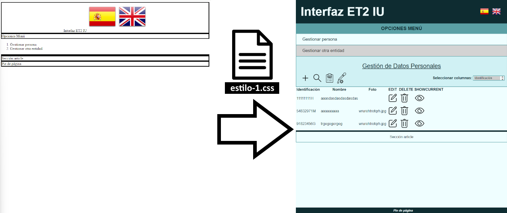

# SEMANA 7: CSS (Parte I)

## Objetivo

En las próximas dos semanas, revisaremos los estilos CSS aplicados en la interfaz de gestión de ejemplo.

En esta primera semana, explicaremos los estilos aplicados en el fichero estilos-1.css, y que permiten a la página mostrarse del siguiente modo:



La siguiente semana, veremos cómo dar estilo a la tabla de gestión de entidades, y a los formularios de cada acción.

## Cambios menores en el fichero index.html

Para poder incluir el fichero CSS de estilo (estilo-1.css), es necesario añadir una línea al fichero index.html:

```html
<head>
    ...
    
    <link rel="stylesheet" type="text/css" href="./Base/css/estilo-1.css" media="screen" />
    
    ...
</head>
```

Adicionalmente, para mejorar el comportamiento visual del despliegue del menú de opciones, hacemos los siguientes cambios en la parte de javascript del fichero index.html:

```html
<script type="text/javascript">
    // Sustituimos esta línea:
    // document.getElementById('div-menu').style.display = 'none';
    // Por esta otra, gestionando la ocultación del menú con una clase "hidden":
    document.getElementById('div-menu').classList.add("hidden");
    
    ...

    // Adaptamos esta función para utilizar la clase y no el style.display:
    function menu_work(){
        if (document.getElementById('div-menu').classList.contains("hidden")){
            document.getElementById('div-menu').classList.remove("hidden");
        }
        else{
            document.getElementById('div-menu').classList.add("hidden");
        }
    }

    ...

</script>
```

## Revisión de los estilos CSS aplicados en estilos-1.css

### Formato general de los selectores CSS

Comencemos explicando el formato básico de los estilos que aplicamos con CSS:

```css
[selector] (, [selector] ... ) {
    propiedad: valor;
    propiedad: valor;
    ...

    & [selector_anidado] { 
        /* 
            ¡El espacio (o su ausencia) entre el & y el selector es importante!
            Indica si seguimos en el mismo nivel o bajamos uno en la jerarquía
        */

        propiedad: valor;
        propiedad: valor;
        ...
    }
    ...
}
```

Los `[selectores]` nos permiten indicar los elementos a los que afectarán las asignaciones de propiedades
que situamos dentro de las llaves. Podemos indicar varios selectores separados por comas.

El `&` nos permite anidar selectores, para evitar repetirlos, son como rutas relativas.


### Creación de variables globales

El selector `:root` nos permite definir variables CSS globales.
Así, por ejemplo, podemos cambiar los colores de toda la web fácilmente.

El formato para definir variables es:

```css
--nombre-variable: valor;
```

El doble guion al inicio es obligatorio.

Para usar una variable, se usa la función `var()`:

```css
color: var(--nombre-variable);
```

En este caso, creamos las siguientes variables globales para colores comunes a toda la interfaz:

```css
:root {
    --light-color: #EFFEFF;
    --medium-color: #a1c2c5;
    --dark-color: #0E2C31;
    --emphasis-color-1: #5ba0a5;
    --emphasis-color-2: #d0f1f4;
}
```

### Selector universal (*)

El selector universal `*` aplica estilos a todos los elementos de la página 
individualmente (En ocasiones, los elementos también heredan estilos de sus padres,
pero en este caso forzamos la aplicación de estilos a cada uno individualmente).

```css
* {
    color: var(--dark-color); /* Color de texto por defecto */
    font-family: sans-serif; /* Fuente por defecto */
}
```

### Selector de elementos (tags) HTML

Estos selectores aplican estilos a todos los elementos de ese tipo.

```css
body {
    /* Estilos del body */
    background-color: var(--light-color); /* Color de fondo */
    margin: 0; /* Elimina el margen por defecto del body */
}
```

### El margen, el borde, el relleno y el contenido de un elemento HTML

Cada elemento HTML tiene propiedades de margen (separación exterior), borde (potencialmente coloreado, con un grosor, estilo, redondeado, etc.), y un relleno (margen interno). Dentro de todo esto, está el contenido del elemento (texto y otros elementos HTML).


### Selector de identificadores (#)

Aplica estilos al elemento con el id indicado tras el `#`.

```css
#header_page {
    display: flex; /* Distribución flexible de elementos */
    flex-direction: row; /* Distribuye elementos en fila */
    align-items: center; /* Centra verticalmente los elementos */
    background-color: var(--dark-color); /* Color de fondo del header */
    padding: 16pt; /* Relleno del header */
    border: 0; /* Sin bordes */
    user-select: none; /* Evita selección de texto */
}
```

### Flexbox

Flexbox en un modo de display de contenedores de CSS que permite distribuir sus elementos hijos de una manera flexible: ordenándolos de diferentes formas, adaptándolos dinámicamente al ancho o alto disponible, saltando de fila o columna, etc.

Este póster explica las características generales ([Más información](https://css-tricks.com/snippets/css/a-guide-to-flexbox/)):


### Selector de hijo directo (>)

Aplica estilos a los elementos que son hijos directos del elemento padre (con espacio, nos referimos a cualquier descendiente: hijos, nietos, bisnietos...).

```css
#header_page > span {
    transition: font-size 300ms; /* Transición suave al cambiar tamaño fuente */
    flex-grow: 1; /* Crece para ocupar todo el ancho posible */
    font-size: 40pt; /* Tamaño fuente título web */
    text-align: left; /* Alinear título a la izquierda */
    font-weight: bold; /* Negrita */
    color: var(--light-color); /* Color de texto del header */
}
```

### Media queries

Las medias queries permiten aplicar estilos CSS dependiendo de las características del dispositivo.
Ejemplos: tamaño de pantalla, orientación, resolución, etc. Las reglas dentro del bloque de `@media (condición)` 
sólo se aplican cuando la condición es cierta.

```css
@media (max-width: 600pt) {
    /* 
        Si la pantalla es menor o igual a 600pt de ancho aplica este estilo, 
        reduciendo el tamaño de la fuente del título de la web para que se vea bien.
    */
    #header_page > span {
        font-size: 30pt; /* Tamaño fuente título web */

        /* Formas de indicar tamaños:
            - pt: puntos (1pt = 1/72 pulgadas)
            - px: píxeles (1px = 1 píxel de la pantalla)
            - em: unidades relativas al tamaño de fuente actual (1em = tamaño fuente actual)
            - %: porcentaje relativo a su contenedor padre
        */
    }
}
```

### Estilos para las banderas de idiomas en la cabecera (y pseudo-clases)

Las pseudo-clases definir estilos para estados especiales de un elemento.

Formato: `selector:pseudo-clase { ... }`

Ejemplos comunes: `:hover`, `:active`, `:focus`, `:visited`, `:first-child`, `:last-child`, etc.

```css
#header_page > img {
    width: 30pt; /* Ancho de las banderas */
    height: 30pt; /* Alto de las banderas */
    padding-left: 5pt; /* Relleno izquierdo de las banderas */
    padding-right: 5pt; /* Relleno derecho de las banderas */
    cursor: pointer; /* Usar el icono de cursor "pointer" */
    transition-property: width, height, padding; /* Propiedades a animar */
    transition-duration: 300ms; /* Duración de la animación */
    user-select: none; /* Evita selección de imagen */
    -webkit-user-drag: none; /* Impide arrastrar la imagen */

    /* :hover - Estilos al pasar el ratón por encima */
    &:hover {
        width: 40pt; /* Ancho de las banderas */
        height: 40pt; /* Alto de las banderas */
        padding: 0; /* Sustituye el padding por ancho y alto, para mantener el tamaño */
    }

    /* :active - Estilos al hacer clic en la imagen */
    &:active {
        width: 28pt; /* Ancho de las banderas */
        height: 28pt; /* Alto de las banderas */
        padding-left: 5pt; /* Relleno izquierdo de las banderas */
        padding-right: 5pt; /* Relleno derecho de las banderas */
    }
}
```

### Estilos para la barra de navegación (Opciones)

```css
nav {
    text-align: center; /* Alinear texto opciones al centro */
    padding: 8pt; /* Añadir relleno */
    font-size: 16pt; /* Tamaño fuente opciones */
    background-color: var(--emphasis-color-1); /* Color de fondo */
    border: 0; /* Sin bordes */
    user-select: none; /* Evita selección de texto */
}
```

### Estilos para el elemento clickable dentro de la barra de navegación

```css
nav > span {
    display: block; /* Mostrar como bloque para ocupar todo el ancho */
    cursor: pointer; /* Usar el icono de cursor "pointer" */
    text-transform: uppercase; /* Convertir texto a mayúsculas */
    font-weight: bold; /* Negrita */

    /* :hover - Estilos al pasar el ratón por encima */
    &:hover {
        text-decoration: underline; /* Subrayar el texto */
    }
}
```

### Estilos para las opciones del menú (y selector de clase)

El selector de clase `.[clase]` aplica estilos a los elementos con esa clase.

Se puede combinar con otros selectores, como veremos en este caso,
para aplicar estilos sólo cuando el elemento padre tiene esa clase.
Formato: `selector.nombre-clase { ... }`

Los espacios entre selectores son importantes:
- Sin espacio: el selector con clase es el mismo elemento.
- Con espacio: el selector con clase es un hijo (en algún nivel) del elemento padre.

```css
#div-menu {
    overflow: hidden; /* Ocultar contenido que sobresalga, para la animación */
    padding: 0; /* Elimina padding */

    /* Contenedor del menú */
    & > ol {
        margin: 0; /* Elimina margen */
        padding: 0; /* Elimina padding */
        border-left: var(--emphasis-color-1) 2pt solid; /* Borde izquierdo */
        border-right: var(--emphasis-color-1) 2pt solid; /* Borde derecho */
    }

    /* Estilos para los elementos de la lista */
    & li {
        margin: 0; /* Elimina margen */
        padding: 0; /* Elimina padding */
        list-style-type: none; /* Elimina viñetas de la lista */
    }

    /* Estilos para los spans dentro de los elementos de la lista */
    & li span {
        display: block; /* Mostrar como bloque para ocupar todo el ancho */
        height: 20pt; /* Altura del elemento */
        line-height: 20pt; /* Alinear texto verticalmente haciendo la línea igual de alta */
        
        transition-property: height, padding-bottom, padding-top; /* Propiedades a animar */
        transition-duration: 500ms; /* Duración de la animación */
        overflow: hidden; /* Ocultar contenido que sobresalga, para la animación */
        
        margin: 0; /* Elimina margen */
        padding-bottom: 8pt; /* Relleno inferior */
        padding-top: 8pt; /* Relleno superior */
        padding-left: 20pt; /* Relleno izquierdo */
        border-bottom: var(--emphasis-color-1) 2pt solid; /* Borde inferior */
        
        cursor: pointer; /* Usar el icono de cursor "pointer" */
        font-size: 14pt; /* Tamaño fuente */
        user-select: none; /* Evita selección de texto */
    }

    /* Estilos especiales para el primer elemento de la lista */
    & li:first-child span {
        padding-top: 8pt; /* Relleno superior */
    }

    /* Estilos de span cuando el menú está oculto */
    &.hidden li span {
        /* Colapsamos el menú */
        height: 0; /* Altura del elemento */
        padding-bottom: 0; /* Relleno inferior */
        padding-top: 0; /* Relleno superior */
        border: 0 /* Sin bordes */
    }

    /* Estilos de span al pasar el ratón por encima */
    & li span:hover {
        background-color: var(--emphasis-color-2); /* Color de fondo al pasar el ratón */
    }

    /* Estilos para elementos deshabilitados */
    & li.disabled span {
        cursor: not-allowed; /* Icono de cursor "not-allowed" */
        background-color: lightgray; /* Color de fondo gris */
        color: rgb(52, 52, 52); /* Color de texto gris oscuro */
    }
}
```

### Estilos para la sección de gestión de la IU

#### Estilos para el título de la página de gestión

```css
#title_page {
    text-align: center; /* Alinear texto al centro */
    font-size: 20pt; /* Tamaño fuente */
    text-decoration: underline; /* Subrayar texto */

    padding: 10pt; /* Relleno */
    border: 0; /* Sin bordes */
    
    user-select: none; /* Evita selección de texto */
}
```

#### Contenedor de cabecera de gestión (Incluye título y controles)
```css
#IU_manage_head {
    display: flex; /* Distribución flexible de elementos */
    flex-direction: column; /* Distribuye elementos en columna */
    
    background-color: var(--emphasis-color-2); /* Color de fondo */
    border: 2pt solid var(--emphasis-color-1); /* Borde */
    border-top: 0; /* Sin borde superior */
    padding: 10pt; /* Relleno */
}
```

#### Grid Layout

Grid Layout es otro método de distribución de elementos dentro de un contenedor, en este caso especificando filas y columnas, una rejilla o cuadrícula, y la extensión que ocupan dentro de ella sus elementos hijos.

Este póster muestra sus principales propiedades ([Más información](https://css-tricks.com/snippets/css/complete-guide-grid/)):


#### Posicionamiento de elementos

En CSS, podemos modificar el flujo habitual de nuestros elementos en su disposición en la página, utilizando la propiedade `position` con los valores que se muestran aquí ([Ejemplo interactivo](https://www.w3schools.com/css/css_positioning.asp)):


#### Contenedor de controles de gestión (y pseudo-elementos)

Los pseudo-elementos son elementos virtuales que no existen en el HTML,
pero que podemos crear y estilizar con CSS.
Son diferentes de las pseudo-clases, que definen estados especiales de un elemento.

Los pseudo-elementos no tienen pseudo-clases propias, pero pueden combinarse con ellas.
Por ejemplo: `[selector]:hover::after { ... }`

Ejemplos de pseudo-elementos comunes: `::before`, `::after`, 
`::first-letter`, `::first-line`, etc.

```css
#add_search_columns {
    display: grid; /* Distribución en cuadrícula */
    grid-template-columns: 40pt 40pt 40pt 40pt auto 100pt; /* Definición de columnas */
    /* Definición de áreas de la cuadrícula */
    grid-template-areas: 
        "add search test_unit test select_title select_cols";
    row-gap: 10pt; /* Espacio entre filas */

    place-items: center; /* Centrar elementos en sus celdas */

    /* Estilos para el label del select */
    & > label {
        grid-area: select_title; /* Área de la cuadrícula */
        text-align: right; /* Alinear texto a la derecha */
        
        width: 100%; /* Ocupa todo el ancho de su celda */
        margin-right: 10pt; /* Margen derecho */
        
        font-weight: bold; /* Negrita */
        user-select: none; /* Evita selección de texto */

        /* Pseudo-elemento ::after - Permite añadir contenido después del elemento */
        &::after {
            content: ":"; /* Añade dos puntos después del texto del label */
        }
    }

    /* 
        Posicionamiento relativo para que el select absoluto se posicione 
        respecto a este contenedor y pueda crecer sin modificar el flujo del documento 
    */
    position: relative; 

    /* Estilos para el select de columnas */
    & > select {
        grid-area: select_cols; /* Área de la cuadrícula */
        
        position: absolute; /* Posicionamiento absoluto */
        top: 10pt; /* Separación superior */
        
        transition: height 0.3s; /* Transición suave al cambiar altura */
        height: 16pt; /* Altura del select */
        padding: 2pt; /* Relleno */
        min-width: 105pt; /* Ancho mínimo del select */
        overflow-y: scroll; /* Añade scroll vertical si es necesario */
        z-index: 10; /* Asegura que el select esté por encima de otros elementos */

        background-color: var(--light-color); /* Color de fondo */
        border: 2pt solid var(--emphasis-color-1); /* Borde */
        
        user-select: none; /* Evita selección de texto */

        /* Estilos al pasar el ratón por encima */
        &:hover {
            height: 100pt; /* Aumenta la altura para mostrar más opciones */
        }
    }

    /* Estilos para los botones (Añadir, Buscar, y los de Test) */
    & > img {
        cursor: pointer; /* Usar el icono de cursor "pointer" */
        transition: transform 0.3s; /* Transición suave al transformar */
        user-select: none; /* Evita selección de imagen */
        -webkit-user-drag: none; /* Impide arrastrar la imagen */

        /* Estilos al pasar el ratón por encima */
        &:hover {
            transform: scale(1.2); /* Aumenta el tamaño al 120% */
        }

        /* Estilos al hacer clic en la imagen */
        &:active {
            transform: scale(0.9); /* Reduce el tamaño al 90% */
        }
    }
}
```

#### Estilos específicos para los botones de Test

```css
#botonTEST_UNIT {
    grid-area: test_unit; /* Área de la cuadrícula */
    width: 30pt; /* Ancho del botón */
    height: 30pt; /* Alto del botón */
}
```

#### Estilos específicos para el botón de búsqueda

```css
#botonTEST {
    grid-area: test; /* Área de la cuadrícula */
}
```

### Estilos para los elementos artículo

```css
article {
    border: 2pt solid var(--emphasis-color-1); /* Borde */
    border-top: 0; /* Sin borde superior */
    text-align: center; /* Alinear texto al centro */
    padding: 10pt; /* Relleno */

    /* Estilo para el texto seleccionado dentro del artículo */
    &::selection {
        background-color: var(--dark-color); /* Color de fondo */
        color: var(--light-color); /* Color de texto */
    }
}
```

### Estilos para los elementos footer

```css
footer {
    position: fixed; /* Posicionamiento fijo */
    bottom: 0; /* Pegado al fondo de la ventana */
    left: 0; /* Pegado al lado izquierdo de la ventana */
    width: 100%; /* Ocupa todo el ancho de la ventana */
    padding: 5pt; /* Relleno */
    border: 0; /* Sin bordes */

    background-color: var(--dark-color); /* Color de fondo */
    color: var(--light-color); /* Color de texto */

    text-align: center; /* Alinear texto al centro */
    font-style: italic; /* Estilo de fuente en cursiva */
    font-weight: bold; /* Negrita */
    font-size: 10pt; /* Tamaño de fuente */
    
    user-select: none; /* Evita selección de texto */
}
```

### Padding para evitar ocultar contenido con elementos fixed y redefinición de elementos

Añadimos `padding-bottom` al body para evitar que el contenido
quede oculto tras el footer fijo.

Como podemos ver, es posible definir estilos para un selector
aunque ya tenga estilos definidos anteriormente (`body` está al inicio del fichero ya).

En ese caso, se aplican ambos estilos, y si hubiese alguna
propiedad repetida, se aplica el último valor definido.

```css
body {
    padding-bottom: 30pt; /* Para tener en cuenta el fixed footer */
}
```


## Resumen final

En esta sesión, hemos revisado un estilo aplicado a la página principal de nuestra aplicación de ejemplo, modificando el aspecto de su cabecera, los botones de selección de idioma, el menú de opciones, la cabecera de gestión de entidades, y las secciones de artículo y pie de página.

La próxima semana, revisaremos un fichero adicional, donde aplicaremos estilo a la tabla de gestión de entidades y a los formularios de las mismas.